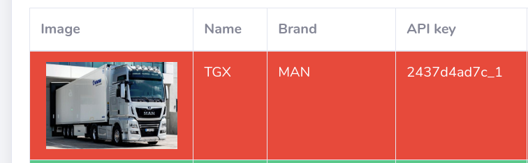
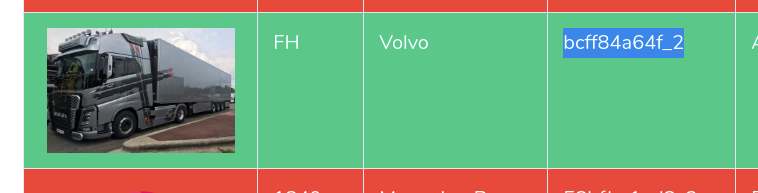
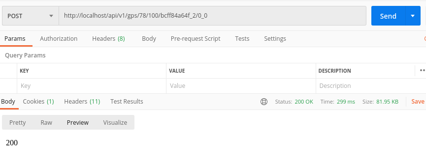
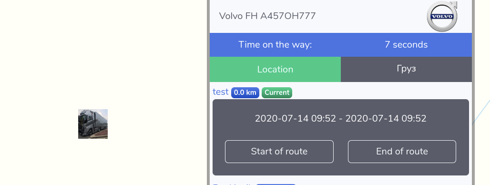
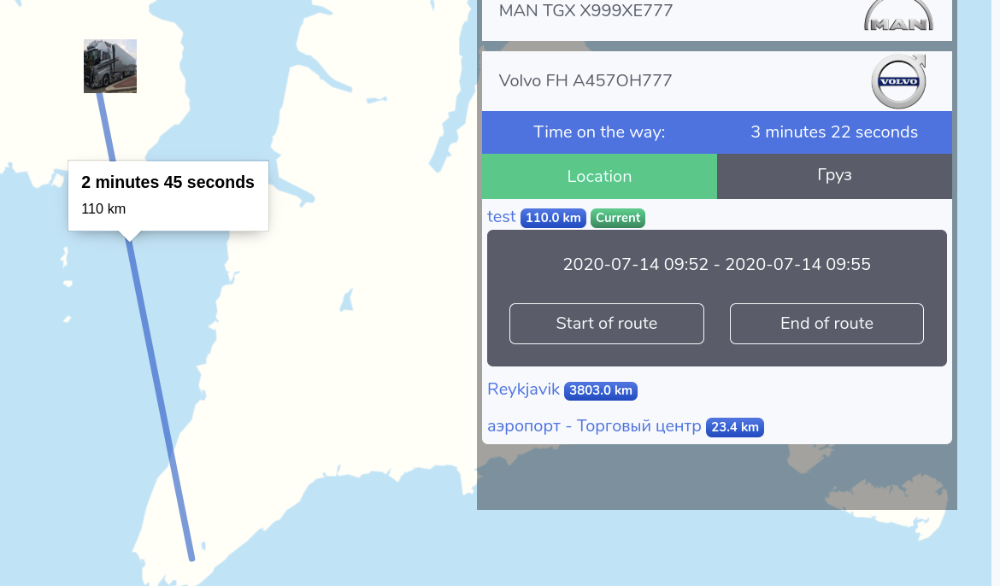
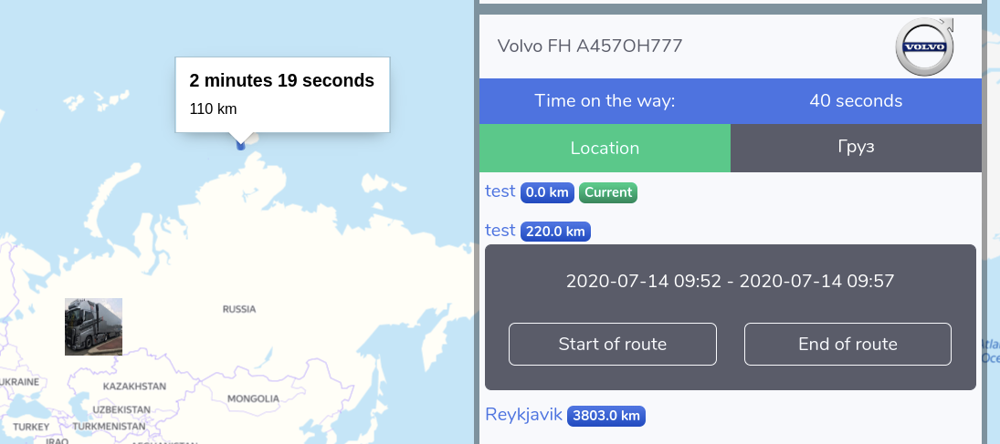

# MAP API 0.1

To create a route, you must send a POST request to the address

```HTTp
http://example.test/api/v1/gps/LATITUDE/LONGITUDE/API_CODE/START_END
```

where:

latitude & longitude - coordinates

API_CODE - generated when creating a car, where the first 10 letters are the code, and the next characters are the car ID.



START -  boolean value 1 or 0. if you want create route write 1

END - Boolean value 1 or 0. If you want to end the route, write 1

------

## example with postman

**create route** 

1. copy api-code

   

2. send POST request on server

   ```http
   http://localhost/api/v1/gps/78/100/bcff84a64f_2/1_0
   ```

   




**create middle point**

send POST request on server

```http
http://localhost/api/v1/gps/79/99/bcff84a64f_2/0_0
```



**end route and create new**

send POST request on server to end route

```http
http://localhost/api/v1/gps/78/99.55/bcff84a64f_2/0_1
```

send POST request on server to create route

```http
http://localhost/api/v1/gps/58/49.55/bcff84a64f_2/1_0
```



